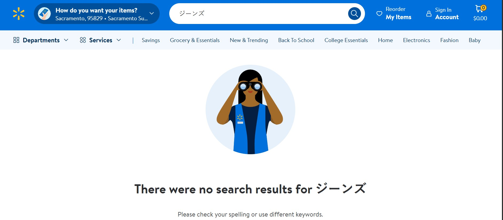
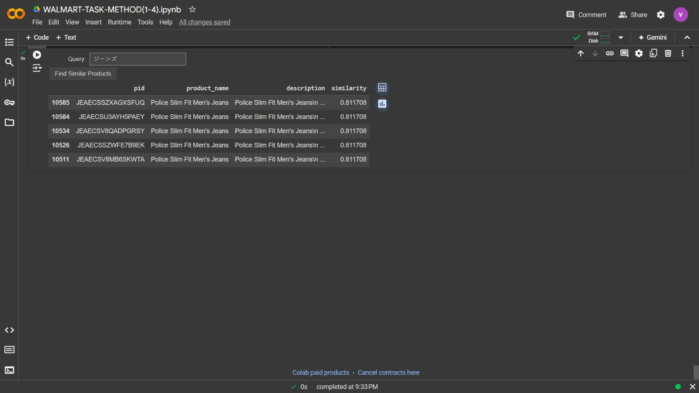

# 🛒 Product Search Retrieval System

This repository contains a Streamlit application designed to retrieve similar products based on a user-provided query using different Aprroaches. The system efficiently processes and analyzes e-commerce product data to find the most relevant products that match the user's query.

## 🎯 Features

- **Interactive Interface:** The app provides an intuitive interface for users to input their product query and receive a list of similar products.
- **Keyword Based Matching:** Utilizes TF-IDF, Word2vec vectorization to measure the similarity between the input query and the product descriptions.
- **Multilingual Support:** Added a feature where a user can put the query in his/her native language and get the best output of te query.
- **Elegant Design:** Includes a polished UI with sections for easy navigation and information display.

## 🧠 Methodology

I have performed EDA also i have implemented the task using 4 various methods
   - Method 1: Using 1) TD IDF 
   - Method 2: Word2vec 
   - Method 3: Lemmatization Approach 
   - Method 4: Multilingual Solution

## 📂 File Structure

```
├── app.py                # Main application script
├── flipkart_com-ecommerce_sample.csv   # Dataset file (example path)
├── README.md             # Project documentation
├── WALMART-TASK-METHOD(1-4).ipynb   # Colab Implementation of all Methods(4)
└── requirements.txt      # requirement file

```

## 📚 Prerequisites

Before you begin, ensure you have met the following requirements:

- **Python 3.8+**
- **Streamlit**: `pip install streamlit`
- **NLTK**: `pip install nltk`
- **Scikit-learn**: `pip install scikit-learn`

## 🚀 How to Run

1. **Clone the Repository:**
   ```bash
   git clone https://github.com/atulbraj/SearchProduct.git
   ```

2. **Install Dependencies:**
   ```bash
   pip install -r requirements.txt
   ```

3. **Run the Streamlit App:**
   ```bash
   streamlit run app.py
   ```
## 🛠️ Usage

- **Input Query:** Enter a keyword or product description into the input box.
- **Retrieve Results:** The app will display a list of similar products based on the input query.


## Issue: (No Multilingual Support in Walmart Search System)


## 🖥️ Implemented Solution

Here are some screenshots of the application in action:
## Multilingual Ouput:


## Streamlit Preview 1 

## Streamlit Preview 2


## THANK YOU


