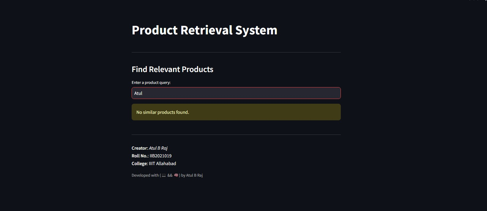

# 🛒 Product Retrieval System

This repository contains a Streamlit application designed to retrieve similar products based on a user-provided query using TF-IDF (Term Frequency-Inverse Document Frequency). The system efficiently processes and analyzes e-commerce product data to find the most relevant products that match the user's query.

## 🎯 Features

- **Interactive Interface:** The app provides an intuitive interface for users to input their product query and receive a list of similar products.
- **TF-IDF Based Matching:** Utilizes TF-IDF vectorization to measure the similarity between the input query and the product descriptions.
- **Efficient Data Handling:** Implements caching to optimize data loading and processing time.
- **Elegant Design:** Includes a polished UI with sections for easy navigation and information display.

## 📚 Prerequisites

Before you begin, ensure you have met the following requirements:

- **Python 3.8+**
- **Streamlit**: `pip install streamlit`
- **NLTK**: `pip install nltk`
- **Scikit-learn**: `pip install scikit-learn`

## 🚀 How to Run

1. **Clone the Repository:**
   ```bash
   git clone https://github.com/atulbraj/SearchProduct.git
   ```

2. **Install Dependencies:**
   ```bash
   pip install -r requirements.txt
   ```

3. **Run the Streamlit App:**
   ```bash
   streamlit run app.py
   ```
## 🛠️ Usage

- **Input Query:** Enter a keyword or product description into the input box.
- **Retrieve Results:** The app will display a list of similar products based on the input query.

## 🧠 Methodology

- **TF-IDF Vectorization:** The application uses TF-IDF to convert textual data into numerical features, emphasizing the importance of rare words in the product descriptions.
- **Cosine Similarity:** The app calculates the cosine similarity between the TF-IDF vectors of the input query and the product descriptions to find the most relevant products.

## 📂 File Structure

```
├── app.py                # Main application script
├── flipkart_com-ecommerce_sample.csv   # Dataset file (example path)
└── README.md             # Project documentation
└── requirements.txt.md 
```

## 🖥️ Screenshots

Here are some screenshots of the application in action:

## Preview 1

## Preview 2



## THANK YOU
